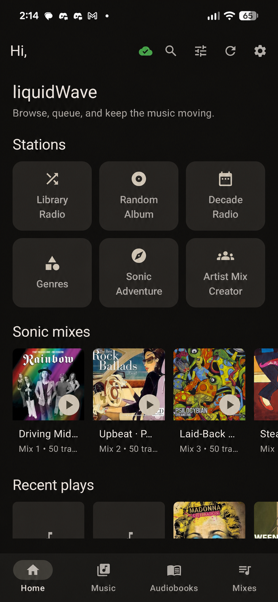
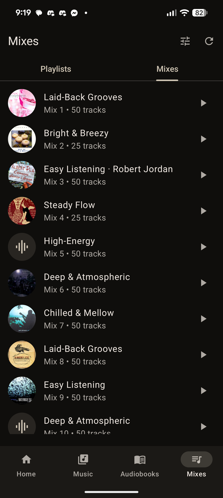
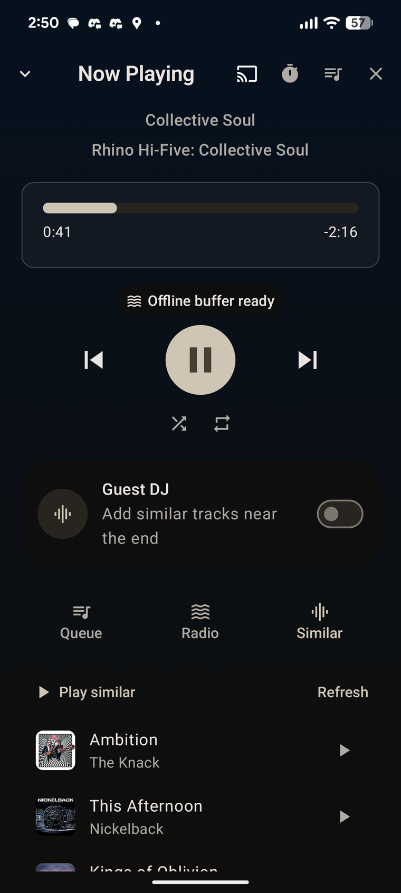
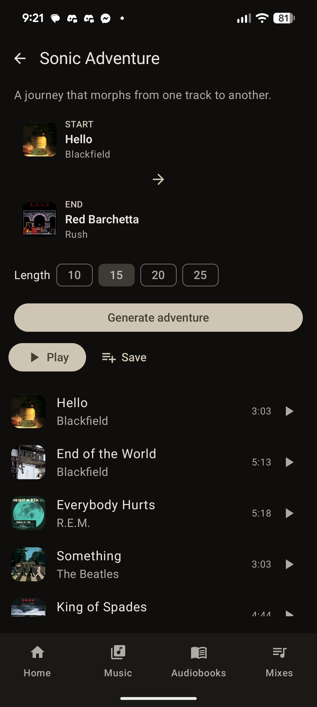
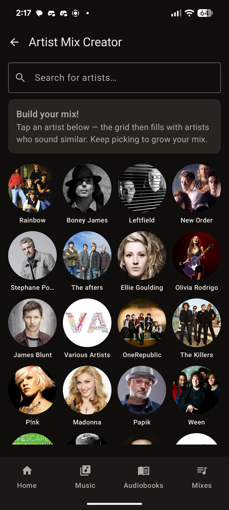
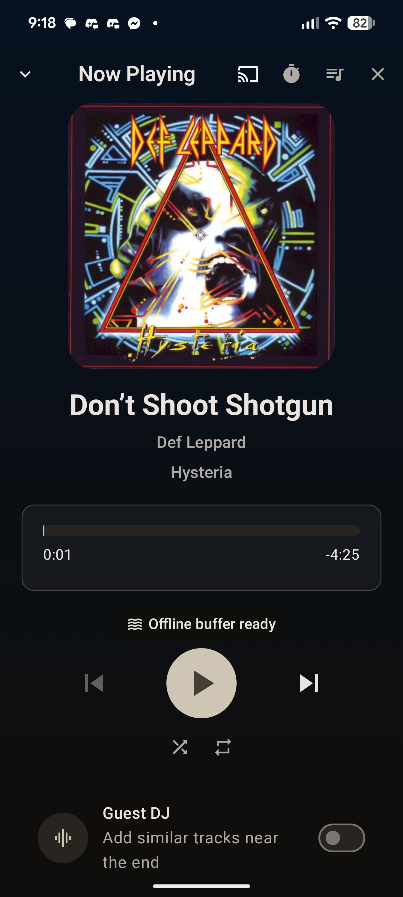
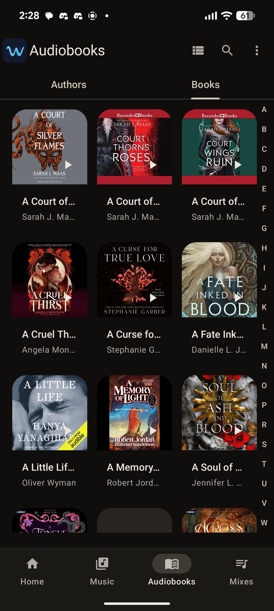
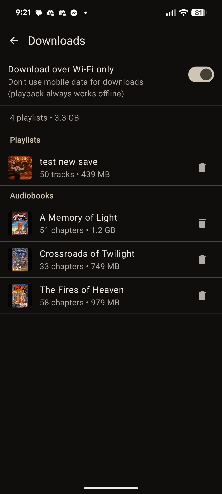
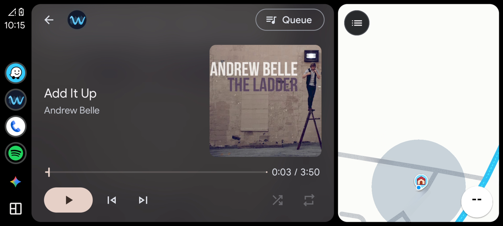

# Emby Sonic

Self-hosted neural audio analysis for Emby — a privacy-first equivalent of
Plexamp's Sonic Analysis. Maps a music library into a multi-dimensional "sonic
space" using audio embeddings (not genre tags), enabling sonically intelligent
discovery: similar tracks/artists/albums, track radio, sonic adventures, auto-curated
mixes, and a Guest DJ.

> **Status:** Phase 1 (Python analysis service) and Phase 2 (C# Emby plugin) complete.
> Phase 3 (Android app, **liquidWave**) is well advanced and running on real
> hardware — browse, Media3 playback, sonic mixes (per-mix refresh), crossfade
> with artwork cross-dissolve, an in-app equalizer, Track Radio, Sonic Adventure,
> the Artist Mix Creator, Stations, Recent Plays, offline playlist downloads,
> per-track volume normalisation, and search across music + audiobooks. See
> [`docs/spec.md`](docs/spec.md) for the full architecture and milestone list,
> and [`docs/faq.md`](docs/faq.md) if something isn't behaving.

## Architecture

```
Emby Server (existing)
└── Emby Plugin (C#, config UI + scan trigger — Phase 2 ✅)
    └── Emby Sonic Coordinator (FastAPI, :8765 — Phase 1 ✅)
        ├── SQLite — metadata, analysis state, playlists
        └── FAISS — 128-dim cosine similarity index

Any LAN machine (e.g. a GPU box)
└── Analysis Workers — claim tracks, stream audio from Emby, embed, report back
```

Workers can run on the Emby host or on any networked machine. They stream audio
directly from Emby's HTTP API — no file shares or special network config needed.

The coordinator also serves a browser app (PWA) at `http://<host>:8765/app` for
non-Android users (iPhone/iPad/desktop). It mirrors the liquidWave app layout —
a home screen with Recent Plays, Stations (Library Radio, Random Album, Decade
Radio, Genres, Sonic Adventure, Artist Mix Creator) and a Sonic Mixes shelf, a
Library tab (Artists A–Z with album/track drill-down, Playlists with
play/shuffle/delete/remove-track), Search (Tracks/Albums/Artists filter chips),
a Mixes tab, and Settings (account + live analysis status, with Log out moved
there rather than a stray top-bar icon). Playback runs through a mini player +
Now Playing overlay (seek, shuffle/repeat, stop) with browser/lock-screen media
controls, and any queue — an artist mix, radio, or a sonic mix — can be saved
back to a real Emby playlist. A "Build Sonic Mixes" trigger in the Mixes tab
handles the initial clustering too, so the web app is a complete standalone
client — no Android device needed to create mixes on a fresh coordinator.
Audiobooks remain Android-only for now; the web app is otherwise close to
feature parity for music.

## Phase 1 — Python Analysis Service

New installs should start with the scenario guide:
[`docs/quickstart.md`](docs/quickstart.md).

### Requirements

- Python 3.11+ (tested on 3.12)
- Emby Server with API key

### Setup

On Windows, the repository wrapper creates a Python 3.12 virtual environment,
installs the CPU development dependencies, and runs the same Python and web-app
checks as CI:

```powershell
.\dev.ps1 bootstrap    # first run, or repair/recreate .venv
.\dev.ps1 test         # subsequent full test runs
.\dev.ps1 check        # environment/import diagnostics only
```

The wrapper uses `.venv\Scripts\python.exe` directly, so a global `python`
command does not need to be on `PATH`. Install Python 3.12 first if the wrapper
reports that `py -3.12` is unavailable.

For Linux, macOS, containers, or a manual installation:

```bash
# CPU-only PyTorch (recommended for Emby hosts; workers can use GPU separately)
pip install torch --index-url https://download.pytorch.org/whl/cpu
pip install -r requirements.txt

cp .env.example .env   # set EMBY_URL and EMBY_API_KEY
python main.py         # coordinator on http://0.0.0.0:8765
```

**GPU workers** (bare metal, not Docker): install a CUDA build of torch instead
of the CPU wheel above, e.g. `pip install torch --index-url
https://download.pytorch.org/whl/cu126` (use `cu126` for older/pre-Ampere GPUs,
or check [pytorch.org](https://pytorch.org/get-started/locally/) for the current
stable cuXXX index). Verify with `python -c "import torch; print(torch.cuda.is_available())"`
before running `worker.py` — a plain `pip install torch` on Windows commonly
resolves to the CPU wheel.

**PANNs CNN14 checkpoint + labels** (~327 MB) — auto-downloaded by workers on
first use (stdlib `urllib`, cross-platform), including the AudioSet labels CSV
that `panns_inference` itself would otherwise try (and, on Windows/NAS, fail)
to fetch via `wget`. No manual step needed. To pre-place or relocate the
checkpoint, set `PANNS_CHECKPOINT_PATH` (default `~/panns_data/Cnn14_mAP=0.431.pth`);
an existing file is reused.

### Deploy on a NAS (Docker)

The coordinator is lightweight (no torch/librosa/panns — those live on workers),
so it runs in a small container on any NAS (Synology, QNAP, UGREEN, ...), including
ARM. Audio analysis runs on separate **workers** on a machine with spare CPU/GPU.

```bash
EMBY_URL=http://<emby-host>:8096 EMBY_API_KEY=<key> docker compose up -d --build
```

This builds [`Dockerfile.coordinator`](Dockerfile.coordinator) and starts the
coordinator on port 8765 with a persistent `emby-sonic-data` volume (SQLite +
FAISS index). Then point the Emby plugin's **Python Service URL** at
`http://<nas-host>:8765` and run one or more workers on your GPU/CPU box — they
stream audio from Emby, so no file shares are needed.

> **Prebuilt images:** coordinator and worker images are published to GHCR on
> every release. Set `COORDINATOR_IMAGE` / `WORKER_IMAGE` and drop `--build` to
> pull instead of build. The guided `./install.sh` does this automatically.

### Benchmark before a full scan

```bash
python benchmark.py /path/to/a/track.flac
```

Reports per-stage timing + real-time factor. Expect ~10–15s/track with GPU workers,
~20–30s/track CPU-only.

### Scanning your library

```bash
# 1. Sync library from Emby (populates the queue; no audio work yet)
curl -X POST http://localhost:8765/sonic/library/scan \
  -H "X-Emby-Token: <your-emby-token>"

# 2. Run a worker (on this machine or any other on the LAN)
COORDINATOR_URL=http://<coordinator-host>:8765 \
WORKER_SECRET=<worker-secret> \
WORKER_ID=my-worker \
python worker.py
```

Workers authenticate to the coordinator with `WORKER_SECRET` when it is set, or
fall back to `EMBY_API_KEY` for older deployments. They auto-detect CUDA. Run
multiple workers in parallel for faster scanning.

> **Music libraries only.** The scan is scoped to Emby libraries whose collection
> type is **`music`** — audiobooks (a separate `audiobooks` library) and other
> audio are never analysed, so spoken-word content can't pollute Track Radio /
> Similar / Adventure. If an earlier scan already embedded audiobooks, clean them
> out with `python tools/purge_audiobooks.py` (dry-run by default; `--apply` to
> delete; rebuilds on the next coordinator restart).

### Backfilling a library analysed before a feature landed

Some playback features read a per-track measurement the worker now takes during
analysis. Tracks embedded *before* that feature have nothing to read, so they
fall back to the old behaviour. These scripts fill them in **without
re-embedding** — CPU-only, the neural model never loads, and resumable (only
rows still missing the value are touched, so stopping and re-running is safe):

```bash
python tools/backfill_loudness.py   # volume normalisation (integrated LUFS)
python tools/backfill_edges.py      # crossfade edge trimming (effective start/end)
```

> **On Docker, run these as a one-off WORKER container on the coordinator's
> host, with the data volume attached — not the coordinator, and not a separate
> worker box** (#40). They need librosa *and* the database, and no single
> container has both by default: the coordinator image deliberately ships
> without librosa (that split is what keeps it small and ARM-buildable), while
> the worker has librosa but doesn't normally mount the DB. And because a Docker
> named volume is local to its host, this must run wherever the volume lives —
> i.e. the coordinator's host, even if your long-running worker is elsewhere:
>
> ```bash
> docker compose run --rm -v emby-sonic-data:/app/data \
>     worker python tools/backfill_edges.py
> ```
>
> Bare metal: run them on the coordinator's host, wherever you installed the full
> `requirements.txt` (not `requirements-coordinator.txt`), pointing `--db` at the
> database.

Measured on an Intel N100 streaming from Emby over LAN, `backfill_edges.py` runs
at **~42 tracks/minute** (~1,000 tracks ≈ 25 min, ~25,000 ≈ 10 hours) — it
decodes each file in full, since a track's edges are precisely what the analyser's
sampled windows skip. `backfill_loudness.py` is quicker (sampled windows only).
Both skip audiobooks where the feature doesn't apply, and both are safe to run
against a live coordinator. Newly-analysed tracks get these from the worker
automatically — these scripts are only for the back catalogue.

### Broken-track maintenance

Tracks that fail analysis are left with `analysis_status='error'` so workers do
not retry the same stale/missing file forever. Export them for library cleanup,
or requeue them after fixing files in Emby:

```bash
# Export id,title,artist,album,file_path,error for all broken tracks.
python tools/broken_tracks.py --db data/sonic.db export --output broken_tracks.csv

# Requeue selected tracks from a prior export CSV.
python tools/broken_tracks.py --db data/sonic.db requeue --csv broken_tracks.csv

# Or requeue every error row.
python tools/broken_tracks.py --db data/sonic.db requeue --all

# Permanently delete broken tracks instead — for ones that will never
# succeed (a corrupt file, or a stale/orphaned Emby library entry with no
# real file behind it). Same --all/--id/--ids-file/--csv selection as requeue.
python tools/broken_tracks.py --db data/sonic.db purge --all
```

Requeue changes `analysis_status` from `error` to `pending`, clears the claim and
error text, and lets the next running worker retry the track. Purge deletes the
row outright, so it stops showing up in the skipped-tracks list; if the same
Emby item still genuinely exists, the next library scan just recreates a fresh
`pending` row for it.

### Keeping the coordinator itself running (bare metal)

A bare `python main.py` in a terminal has nothing supervising it — close the
window, let the box sleep, or hit an unhandled exception, and the coordinator's
listening socket is just gone until you restart it by hand. The Emby plugin
then shows "Service: offline" and workers get connection-refused errors
posting results. On Windows, install it as a supervised, auto-restarting
scheduled task instead:

```powershell
# Run elevated, on the box that should host the coordinator:
./deploy/coordinator-install.ps1
```

Runs as SYSTEM, starts at boot, restarts automatically if it dies, no console
window. (Docker deployments don't need this — see "Deploy on a NAS" above,
which already runs the coordinator as a supervised container.)

Inspect or safely restart either Windows task with the shared operations tool:

```powershell
# Read-only task, process, and health status:
./deploy/service-control.ps1 -Service coordinator -Action status
./deploy/service-control.ps1 -Service worker -Action status

# Preview the exact stop/process-sweep/start operations:
./deploy/service-control.ps1 -Service coordinator -Action restart -WhatIf

# Perform the restart (run elevated on the service host):
./deploy/service-control.ps1 -Service coordinator -Action restart
```

The generated launcher supervises a child Python process that Task Scheduler
does not stop itself. The operations tool identifies that child using the exact
repository launcher, configured Python executable, and service entry point
before restarting, then waits for coordinator HTTP readiness or a live worker
process. Avoid restarting these tasks with `Stop-ScheduledTask` and
`Start-ScheduledTask` directly, which can leave the child behind.

### Automatic analysis (worker as a service)

For hands-off operation, install the worker as an OS service so newly added
tracks are analysed without running anything manually. The
[Emby plugin](plugin/) already triggers a library scan on every add; the worker
then drains the queue on its own.

**Windows scheduled task:**

```powershell
# On the coordinator / server box — always-on worker (run elevated):
./deploy/worker-install.ps1 -Mode service

# On a separate GPU desktop you also use — only runs while the machine is idle:
./deploy/worker-install.ps1 -Mode idle -CoordinatorUrl http://<coordinator-host>:8765
```

`service` mode runs as SYSTEM, starts at boot, and restarts if it dies. `idle`
mode runs only when the machine is idle and stops the instant you return, so it
never fights your foreground work. Both can run together on different machines.

The script auto-detects the repo + `.venv`, writes the run wrapper, and pins
`USERPROFILE` so `panns_inference` finds its model under SYSTEM. See
`./deploy/worker-install.ps1 -?` for all options.

**Linux systemd service:**

```bash
# On the coordinator / server box:
sudo ./deploy/worker-install.sh

# On a separate GPU/CPU worker box:
sudo ./deploy/worker-install.sh --coordinator-url http://<coordinator-host>:8765
```

The Linux installer renders [`deploy/emby-sonic-worker.service`](deploy/emby-sonic-worker.service)
into `/etc/systemd/system`, runs from the repo venv, restarts on failure, starts
at boot, and reads `EMBY_URL` / `EMBY_API_KEY` from the repo `.env`.

### Docker (optional — for NAS / Linux hosts)

Coordinator-only NAS deploy:

```bash
EMBY_URL=http://<emby-host>:8096 EMBY_API_KEY=<key> docker compose up -d --build coordinator
```

Coordinator plus worker in Compose:

```bash
EMBY_URL=http://<emby-host>:8096 EMBY_API_KEY=<key> docker compose up -d --build
```

The Compose `worker` service builds the full [`Dockerfile`](Dockerfile), runs
`python worker.py`, and stores the CNN14 checkpoint in the named
`emby-sonic-panns` volume mounted at `/root/panns_data`, so the ~327 MB model is
not redownloaded on every container rebuild/restart. Workers stream audio from
Emby; no music library bind mount is needed.

Worker images are CPU-only by default. To build a GPU-capable worker, set
`TORCH_VARIANT` before building: `cuda` for CUDA 12.8+ (modern GPUs), `cu126`
for CUDA 12.4 (older / pre-Ampere GPUs). The guided `./install.sh` detects your
CUDA version and picks the right image automatically.

```bash
# Keep the coordinator running normally.
EMBY_URL=http://<emby-host>:8096 EMBY_API_KEY=<key> docker compose up -d --build coordinator

# Build a CUDA-capable worker image and run it with the NVIDIA runtime.
TORCH_VARIANT=cuda docker compose build worker
EMBY_URL=http://<emby-host>:8096 EMBY_API_KEY=<key> \
  docker compose run --rm --gpus all worker
```

For a detached GPU worker, uncomment `gpus: all` under the `worker` service in
[`docker-compose.yml`](docker-compose.yml), then run:

```bash
TORCH_VARIANT=cuda EMBY_URL=http://<emby-host>:8096 EMBY_API_KEY=<key> \
  docker compose up -d --build worker
```

The startup log is the proof: `docker compose run --rm --gpus all worker` prints
`[worker <id>] device=cuda` to the terminal. For a detached worker, check
`docker logs emby-sonic-worker`. If it says `device=cpu`, confirm the image was
built with `TORCH_VARIANT=cuda` and that `nvidia-smi` works inside a test
container.

> **Prebuilt images:** published to GHCR on every release — `…-worker:latest`
> (CPU), `:cu126` (CUDA 12.6, older GPUs), or `:cuda` (CUDA 12.8+). Set
> `WORKER_IMAGE` and drop `--build` to pull instead of build.

Standalone worker container:

```bash
docker build -t emby-sonic-worker .
docker run -d --name emby-sonic-worker \
  -e COORDINATOR_URL=http://<coordinator-host>:8765 \
  -e EMBY_URL=http://<emby-host>:8096 \
  -e EMBY_API_KEY=<key> \
  -v emby-sonic-panns:/root/panns_data \
  emby-sonic-worker python worker.py
```

Standalone NVIDIA GPU worker (use `cu126` instead of `cuda` for older / pre-Ampere hardware):

```bash
docker build --build-arg TORCH_VARIANT=cuda -t emby-sonic-worker:cuda .
docker run -d --name emby-sonic-worker-gpu --gpus all \
  -e COORDINATOR_URL=http://<coordinator-host>:8765 \
  -e EMBY_URL=http://<emby-host>:8096 \
  -e EMBY_API_KEY=<key> \
  -v emby-sonic-panns:/root/panns_data \
  emby-sonic-worker:cuda python worker.py
docker logs emby-sonic-worker-gpu | grep 'device='
```

### Network access

Besides your own Emby server, the containers make outbound calls to a small,
fixed set of domains — useful if you run a firewall/router that flags new
outbound traffic:

| Domain | Called by | Why |
|---|---|---|
| `pypi.org`, `pythonhosted.org` | build time (`pip install`) | Resolving/downloading the Python dependencies in [`requirements.txt`](requirements.txt) / [`requirements-coordinator.txt`](requirements-coordinator.txt). Not called at runtime once built. |
| `download.pytorch.org` | build time (`pip install torch`) | The CPU/CUDA PyTorch wheel, per [`Dockerfile`](Dockerfile)'s `TORCH_VARIANT` install step. |
| `zenodo.org` | worker, first run only | One-time download of the ~327 MB PANNs `Cnn14_mAP=0.431.pth` checkpoint (pretrained AudioSet audio-tagging model) from its author's own hosting. Cached in the `emby-sonic-panns` volume — see above — so it should only be fetched once per volume, not on every restart. |
| `ghcr.io` | anyone using prebuilt images | Pulling the published `coordinator`/`worker` images instead of building locally. |

If `zenodo.org` is being called repeatedly rather than once, the checkpoint
isn't persisting — check that `-v emby-sonic-panns:/root/panns_data` (or the
Compose equivalent) is actually mounted and that the volume hasn't been
recreated (e.g. by `docker compose down -v`).

## API

All user-facing routes are under `/sonic` and require an `X-Emby-Token` header
(validated against Emby's `/System/Info`). Worker routes use `X-Worker-Token`.

| Endpoint | Method | Description |
|---|---|---|
| `/sonic/auth/login` | POST | Browser login proxy to Emby's `AuthenticateByName` |
| `/sonic/search/tracks` | GET | Authenticated browser track-search proxy to Emby |
| `/sonic/status` | GET | Analysis progress + library stats |
| `/sonic/tracks/{id}/similar` | GET | Sonically similar tracks |
| `/sonic/tracks/{id}/radio` | GET | Track radio playlist |
| `/sonic/adventure` | POST | Mood-transitioning playlist A→B |
| `/sonic/mixes` | GET | Auto-curated mixes (named by sonic character + dominant artist) |
| `/sonic/mixes/{id}` | GET | One mix with its tracks |
| `/sonic/mixes/{id}/regenerate` | POST | Refresh one mix: full track turnover from its stored centroid, on-theme |
| `/sonic/queue/inject` | POST | Guest DJ queue injection |
| `/sonic/artists/{id}/similar` | GET | Similar artists |
| `/sonic/albums/{id}/similar` | GET | Similar albums |
| `/sonic/library/scan` | POST | Trigger library sync |
| `/sonic/library/build-mixes` | POST | Rebuild auto-curated mixes (k-means) |
| `/sonic/library/build-state` | GET | Report whether a mix rebuild is running |

Interactive docs at `http://<host>:8765/docs` once running.

## Configuration

Set via environment variables or a `.env` file:

| Variable | Default | Description |
|---|---|---|
| `EMBY_URL` | `http://localhost:8096` | Emby server URL. Use the **LAN address** (e.g. `http://192.168.1.10:8096`) even if Emby runs on the same host as the coordinator — **not** `localhost`/`127.0.0.1`. The web app hands this to the browser to fetch music directly, so a loopback address makes every browser look for Emby on itself: login works, library is empty |
| `EMBY_URL_EXTERNAL` | *(blank = same as `EMBY_URL`)* | Emby's publicly-reachable address (FQDN/reverse proxy). Only needed for the web app: it streams audio browser→Emby directly, so a LAN-only `EMBY_URL` fails for anyone loading the page over WAN. Set this and the web app picks whichever address the browser loaded the page from |
| `EMBY_API_KEY` | *(required)* | Emby API key for coordinator admin calls and worker audio downloads |
| `WORKER_SECRET` | falls back to `EMBY_API_KEY` | Shared secret required in `X-Worker-Token` for worker routes |
| `AUTH_CACHE_TTL_SECONDS` | `30` | Seconds to cache successful Emby user-token validation by SHA-256 digest; `0` disables caching |
| `AUTH_CACHE_MAX_ENTRIES` | `1024` | Maximum successful token digests retained in the in-process validation cache; `0` disables caching |
| `HOST` | `0.0.0.0` | Bind address |
| `PORT` | `8765` | Bind port |
| `NUM_WINDOWS` | `3` | Windows sampled per track (speed/quality knob) |
| `WINDOW_SECONDS` | `30` | Duration of each analysis window |
| `EMBEDDING_DIM` | `128` | PCA target dimensionality |

## Phase 2 — Emby Plugin

A .NET 8 plugin (`plugin/`) that adds an Emby dashboard config page (set the
coordinator URL, view live analysis status — including a "skipped tracks" list
with the reason each couldn't be analysed — and trigger scans / mix rebuilds) and
fires an incremental scan when tracks are added to the library.

> **Requires Emby Server 4.8 or newer.** .NET assembly binding only resolves
> "upward", so a plugin must be built against an Emby SDK **no newer** than the
> target server or Emby silently skips it (it never appears on the Plugins page).
> The shipped builds target the 4.8 SDK, so they load on 4.8 / 4.9 stable and the
> 4.10 beta alike. If you build it yourself, use the oldest Emby you want to
> support — see the note in `plugin/EmbysonicPlugin.csproj`.

**Build** (requires the .NET 8 SDK and Emby's SDK DLLs in `plugin/lib/` —
`MediaBrowser.Common.dll`, `MediaBrowser.Controller.dll`, `MediaBrowser.Model.dll`,
copied from your Emby install's `system/` folder; they are not redistributable):

```powershell
cd plugin
./build.ps1            # Release build + dist/EmbysonicPlugin_<version>.zip
```

**Install:** Emby (unlike Jellyfin) has no plugin-zip upload in its dashboard, so
the plugin is installed by placing its DLL in Emby's `programdata/plugins/` folder.
The release zip ships install scripts that do this for you — run on the Emby host:

```powershell
./install.ps1         # Windows: auto-detects Emby, copies DLL, restarts
```
```bash
./install.sh          # Linux: auto-detects Emby plugins dir, copies DLL
```

Or copy `EmbysonicPlugin.dll` into `…/Emby-Server/programdata/plugins/` manually
and restart Emby. The plugin then appears under **Dashboard → Plugins → Emby Sonic**.

The plugin talks to the coordinator over HTTP; run the coordinator wherever it's
convenient (same host or another LAN machine) and point the plugin's config page
at its URL.

## Phase 3 — Android app (liquidWave)

A Kotlin / Jetpack Compose app (`android/`, package `guru.liquid.embysonic`,
minSdk 26). Browse/stream/auth go to the **Emby API directly**; sonic features go
to the **coordinator**. Stack: Compose + Hilt + Retrofit/OkHttp (two clients) +
Media3 ExoPlayer + DataStore.

**Features:** library + audiobook browse with A–Z fast-scroll; a library picker
when your server has more than one music or audiobook library (switch via a
dropdown on the Library screen — the choice is remembered across restarts and
also scopes Home, Search, and Artist Mix); Now Playing with
queue, shuffle/repeat, mini player, and a system media notification; durable
audiobook resume; music crossfade with a synced artwork cross-dissolve; an in-app
equalizer (presets + per-band, also broadcasts its session for external EQ apps);
auto-curated sonic mixes (per-mix refresh, save as playlist); Track Radio; Sonic
Adventure (a sonic journey from one track to another); the Artist Mix Creator
(pick a set of artists — the grid suggests sonically similar ones as you go —
then build a shuffled cross-artist mix, sized by the shared "tracks per mix"
setting); Stations (Library / Random Album / Decade radios); Recent Plays; offline
downloads (download a playlist or a whole audiobook's original source files for
browsing and playback with no network — audiobooks keep durable resume across the
offline→online boundary; Wi-Fi-only by default; managed under Settings → Downloads;
a foreground service keeps a download alive if the app is backgrounded, with a
progress notification and a download-complete notification when it finishes);
per-track **volume normalisation** (levels playback to a consistent loudness using
the coordinator's measured LUFS — a `GainAudioProcessor` in the audio sink, toggle
in Settings, on by default); a **configurable offline prefetch buffer** (Settings →
Offline prefetch, 3/5/10/15 tracks ahead) to ride through signal drops; a
**responsive Now Playing** that switches to compact chrome in short panes
(split-screen, AppPair) so transport controls stay visible; a **Dynamic** theme
that follows the system light/dark setting (in the app and the Now Playing
widget), alongside five fixed dark palettes; Android Auto shuffle/repeat controls
(mirrored in the notification shade) alongside its Playlists/Stations browse tree;
and search across music (tracks/albums/artists), audiobooks (books/authors), or
everything from Home.

<table>
<tr>
<td width="25%"><br><sub>Home</sub></td>
<td width="25%"><br><sub>Sonic Mixes</sub></td>
<td width="25%"><br><sub>Track Radio &amp; Similar</sub></td>
<td width="25%"><br><sub>Sonic Adventure</sub></td>
</tr>
<tr>
<td width="25%"><br><sub>Artist Mix Creator</sub></td>
<td width="25%"><br><sub>Now Playing</sub></td>
<td width="25%"><br><sub>Audiobooks</sub></td>
<td width="25%"><br><sub>Offline downloads</sub></td>
</tr>
</table>


<sub>Android Auto</sub>

### Build

Requires the Android SDK (platform android-36) and JDK 17 (Android Studio's
bundled JBR works).

```bash
cd android
JAVA_HOME="<path-to-jdk17>" ./gradlew :app:assembleDebug
# APK: android/app/build/outputs/apk/debug/app-debug.apk
```

### Release build

Release builds are R8-minified and resource-shrunk. They are signed with the
release key **only if** the four properties below are present; **if they are
absent, `assembleRelease` silently falls back to the debug signing config** so
contributors can still produce an installable APK without the keystore. Check
what you actually got before distributing a build:

```bash
apksigner verify --print-certs android/app/build/outputs/apk/release/app-release.apk
# "CN=Android Debug" means the fallback was used — NOT a real release signature.
```

Put these in `~/.gradle/gradle.properties` or export them as environment
variables; never commit the keystore or passwords:

```properties
LIQUIDWAVE_RELEASE_STORE_FILE=/absolute/path/to/liquidwave-release.jks
LIQUIDWAVE_RELEASE_STORE_PASSWORD=...
LIQUIDWAVE_RELEASE_KEY_ALIAS=...
LIQUIDWAVE_RELEASE_KEY_PASSWORD=...
```

```bash
cd android
JAVA_HOME="<path-to-jdk17>" ./gradlew :app:assembleRelease
# APK: android/app/build/outputs/apk/release/app-release.apk
```

### Install on a phone (USB or wireless ADB)

The debug APK is fine for real use (debug vs release doesn't affect audio).

**USB:** enable *Developer options → USB debugging*, plug in, then:

```bash
adb install -r android/app/build/outputs/apk/debug/app-debug.apk
```

**Wireless ADB** (no cable; Android 11+): on the phone, *Developer options →
Wireless debugging*. Pair once, then connect and install — after pairing, only
the port changes between sessions:

```bash
# one-time pairing (use the IP:port + 6-digit code from "Pair device with pairing code")
adb pair <phone-ip>:<pair-port> <code>
# then each session (IP:port from the main Wireless debugging screen):
adb connect <phone-ip>:<connect-port>
adb -s <phone-ip>:<connect-port> install -r android/app/build/outputs/apk/debug/app-debug.apk
```

On first launch, enter your Emby server URL + credentials and the coordinator URL
in the login screen. The phone must be on the same LAN as Emby and the coordinator.

### Android Auto (sideloaded build)

Because the app is sideloaded (not from the Play Store), Android Auto hides it by
default. To use it in the car, enable Android Auto **developer mode** and allow
unknown sources — once, on the phone:

1. Android Auto settings → tap the **Version** repeatedly to unlock *Developer settings*.
2. Developer settings → enable **Unknown sources**.

liquidWave then appears in Android Auto's app list. (A future Play Store release
won't need this.)

## License

MIT — see [`LICENSE`](LICENSE). Free to use, modify, and distribute.

## Testing it / private beta

If you run Emby and want to try liquidWave, see the
[tester quickstart](docs/tester-quickstart.md) — it walks through standing up the
coordinator, installing the plugin, running a worker to analyse your library, and
installing the Android app.
