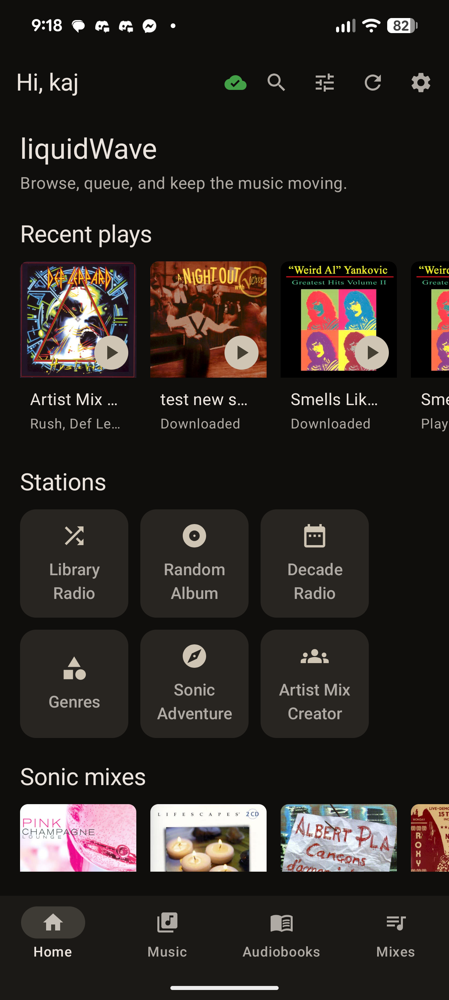
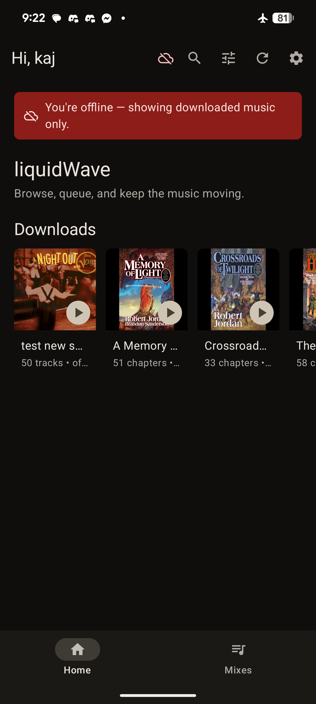

# Forum post — DRAFT

> Working draft for the Emby forum "looking for testers" post. Voice = Kaj, first
> person, enthusiast-to-enthusiast. `[SCREENSHOT: …]` marks where to drop images.
> Nothing here is final — we'll keep polishing.

---

## Title options

- **liquidWave — Sonic Analysis for your Emby music library (private beta, looking for testers)**
- **I built the Plexamp "Sonic Analysis" experience for Emby — self-hosted. Want to test it?**
- **Sonic similarity / radio / auto-mixes for Emby music — beta testers wanted**

---

## Post body

**TL;DR:** I've been building a self-hosted system that adds Plexamp-style *sonic
analysis* to an Emby music library — sonically similar tracks, track radio, "sonic
adventures" between two songs, and auto-curated mixes — plus a companion Android app
(**liquidWave**). It's fully self-hosted, nothing leaves your network, and I'm looking
for a few testers who run Emby and don't mind a bit of setup.

### Why I built it

I've always loved the **Sonic Analysis** feature in Plex/Plexamp. The problem is, I
don't want to run Plex — I much prefer **Emby** for all of my other media — and there
has never been an Emby solution for doing sonic analysis on the music in an Emby
library. It's the one thing that kept pulling me back to Plex, and I didn't want it to.

My music collection is old, big, and honestly not very well organised, and I'm lazy
about fixing that. What I love about sonic analysis is that it lets me build
listenable, automated playlists from a single starting point — a track, a mood, a
vibe — *without* me having to tag and curate everything by hand. That's the whole
reason I wanted this.

So with the recent rise of AI tooling, it finally felt like the right time to actually
attempt it.

### A note on how it was built

I'll be upfront: I built this with heavy use of AI (Claude and Codex). I know a lot of
people see "made with AI" and assume junk — but it genuinely isn't that easy. It takes
a long time, and you essentially have to become a good project manager: guiding the AI,
making the architecture calls, testing on real hardware, and dragging it back on track
when it wanders. I've been working hard on this for a while. I built it **for myself,
from scratch**, and deliberately didn't go looking at other apps — I just wanted to
build in the features *I* actually use.

One of those is **audiobook support**, because my wife loves audiobooks and that was
important to her — so liquidWave handles books (with durable resume) alongside music.

### What it does

- **Sonically similar tracks / artists / albums** — based on how the music *sounds*
  (neural audio analysis), not genre tags.
- **Track Radio** — an endless queue seeded from any track.
- **Sonic Adventure** — pick a start track and an end track, and it builds a journey
  that morphs from one to the other.
- **Auto-curated Mixes** — sonically consistent mixes built from your library; refresh
  any mix, or save it as a real playlist.
- **Stations & Guest DJ** — Library / Random Album / Decade radios, plus a Guest DJ
  that injects sonically matched tracks into your queue.
- **Artist Mix Creator** — pick an artist and the grid repopulates with sonically
  similar artists; keep adding the ones you want, then build a shuffled mix that
  spans the whole selection.
- **A proper player** — Media3/ExoPlayer, queue, shuffle/repeat, crossfade with an
  artwork cross-dissolve, an in-app equalizer, a Now Playing home-screen widget,
  **Android Auto**, and **Google Cast** to a Chromecast / Android TV / Shield.
- **Offline buffer** — the next few tracks in your queue are silently pre-cached in
  the background, so brief Wi-Fi blips don't interrupt playback. No manual download
  needed; you'll see "Offline buffer ready" in Now Playing when it's topped up.
- **Audiobooks** — browse by book/author, durable resume, speed control.
- **Offline downloads** — download any playlist **or a whole audiobook** (the
  original source files, no transcode) to your phone and browse + play it with **no
  connection at all** — on a plane, underground, wherever. Downloads get their own
  row on Home (with cover art) and a badge in your Playlists; an online/offline
  indicator shows the connection state; downloads are **Wi-Fi-only by default**.
  Audiobooks keep **durable resume** even fully offline, and your position syncs back
  to Emby the moment you reconnect. Managed under Settings → Downloads (Playlists and
  Audiobooks), with a one-tap "remove download" that leaves the item itself untouched.
- **Themeable** — follows your system dark/light theme automatically.
- **Search** across music, audiobooks, or everything.

 

 

### You can try it as a plain Emby player first

Worth knowing: the sonic backend is **optional**. The app on its own is a fully
working **Emby music + audiobook player** — you can install it, skip the coordinator
entirely, and have a usable player straight away. Browse, full playback (queue,
shuffle/repeat, crossfade, EQ, mini player, the Now Playing widget, **Cast**),
audiobook resume + speed, Emby playlists, Recent Plays, **offline playlist
downloads**, search, and the metadata Stations all work with nothing but your Emby
server — and a downloaded playlist then plays with no server at all.

The sonic features — **Mixes, Track Radio, Similar, Sonic Adventure, Guest DJ, and the
Artist Mix Creator** — are what the backend adds on top. Without it they just stay
empty; the app degrades gracefully rather than breaking. So you can get the player
running on day one and stand up the analysis side at your leisure.

### Self-hosted and private — by design

This is built privacy-first. **It's your music, your server, your network.**

- **It's completely non-destructive.** Your music and audiobook files are never
  changed, re-tagged, moved, or deleted — the analysis only ever *reads* (streams)
  your audio, and stores its results in its own separate database. The only things it
  ever writes are the normal playback state any Emby app writes (play counts / resume
  position), and a playlist *only* if you explicitly choose to save a mix.
- Everything runs on **your own hardware** — there's no account, no cloud service, no
  analytics, and **no telemetry**. Nothing about your library or listening is sent to
  me or anyone else.
- The audio analysis happens **locally**. The similarity index lives in a small file on
  your own machine and never leaves it.
- The **only** outbound connection the system makes is a one-time download of the
  neural model (~327 MB) on first run — after that the analysis stack can run fully
  air-gapped.
- It's designed to live **inside your LAN** (behind your VPN if you want remote access,
  exactly like you'd treat Emby itself). I'll be clear in the docs about not exposing it
  to the public internet.

### It runs on whatever you've got

This was honestly one of the hardest parts to get right, so I'm a bit proud of it. The
system is split into a tiny **coordinator** (runs anywhere — Windows, Linux, macOS, or a
Docker container on an ARM NAS) and a separate **worker** that does the heavy analysis
on whatever box has spare power. **A GPU makes it faster but is not required** — CPU
works, it just takes longer.

| Your setup | Coordinator | Worker |
|---|---|---|
| NAS (Synology/QNAP/ARM) runs Emby | Docker on the NAS | Your desktop/gaming PC |
| One Windows box does everything | On that box | Same box (CPU or GPU) |
| Linux server + a separate GPU rig | On the server | On the GPU box |
| No GPU anywhere | Either | Any box, CPU-only — just slower |

You should never have to compile a native dependency — the painful cross-platform bits
(PyTorch builds, optional Essentia, the model download) are handled by the defaults and
Docker images.

### The honest state of it

It's a **private beta**, and I want to be straight about that:

- **Android only** for now (iOS is a much later maybe).
- The first library analysis is a **one-time slow job** — roughly 10–15 s/track on a
  GPU, 20–30 s CPU-only. A few thousand tracks is an overnight run; after that it's
  automatic as you add music.
- A couple of known rough edges I'm still working on (e.g. on-device token encryption).
- The app is a debug build for now (installs fine by sideloading).

It's running on my own gear every day and is genuinely usable — but you'll be early.

### Interested in testing?

Before you put your hand up, have a read of the
**[tester quickstart](https://gist.github.com/liquidguru/a8f44b11b744f0d163653a3a7042f12a)**
— it covers exactly what you'll need to stand up (coordinator + plugin + worker + Android
app) and how long it takes. It's not a one-click install, but it's not deep either.

You're a good fit if you **run Emby, can install a plugin and restart your server, and
don't mind following a checklist.** A GPU helps with the initial library analysis but
isn't required.

If that looks manageable and you want in, **reply to this post or send me a DM** with a
rough picture of your setup — Emby host OS, whether you have a GPU, and roughly how big
your library is. I'll send you the files and repo access directly. I'm keeping this small
to start so I can actually act on the feedback.

Thanks for reading — this has been a real labour of love. 🌊

---

## Notes for Kaj (not part of the post)

- **Decide how hard to lean on the AI-built angle.** I've written it as honest +
  defensive-but-proud, which fits you. Some forum folks react badly to "made with AI" —
  but being upfront usually lands better than hiding it and getting found out. Your call
  on tone/length of that section.
- **Reach-me line:** pick one — forum DM, your email, or "open a GitHub issue."
- **Screenshots:** 4–6 good ones beat a wall of them. Suggested: Home, Now Playing
  (with art), Mixes, Sonic Adventure, and the Settings/analysis-status card to show the
  self-hosted machinery.
- **Quickstart Gist** is live: https://gist.github.com/liquidguru/a8f44b11b744f0d163653a3a7042f12a — update it via `gh gist edit` if the setup steps change.
- **Repo + files**: send to confirmed testers only (GitHub collaborator invite + private Release link). No need to go public.
- **Check the forum's rules** on self-promo / linking before posting.
